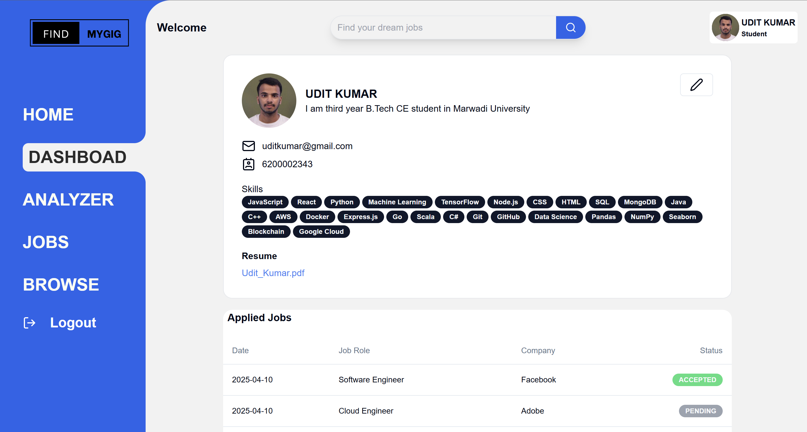

# Ai Powered Job Matching Platform

This is Mern Stack Project in which we use the Reactjs Nodejs Express MongoDB, Gemini Jwt Cloudnary 

## How to Run The Program

- Step 1: Clone the Project https://github.com/iamtidu/Ai-Powered-Job-Matching-Platform.git
- Step 2:
    - Goto `Cd Backend` and run `npm i`
    - create .env file and add the setup it
    - Goto `Cd Client` and Run `npm i`
    - create .env file and add the setup it for gemini
- step 3 (two ways):
    - 1. Run in backend and clinet run using `npm run dev`
    - 2. In Main folder run `npm i` and then `npm start` for run both code at one time

### Output:

        